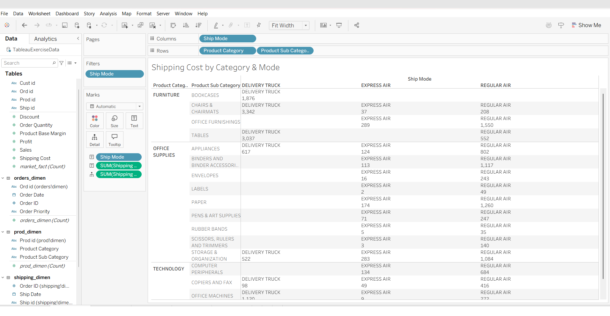
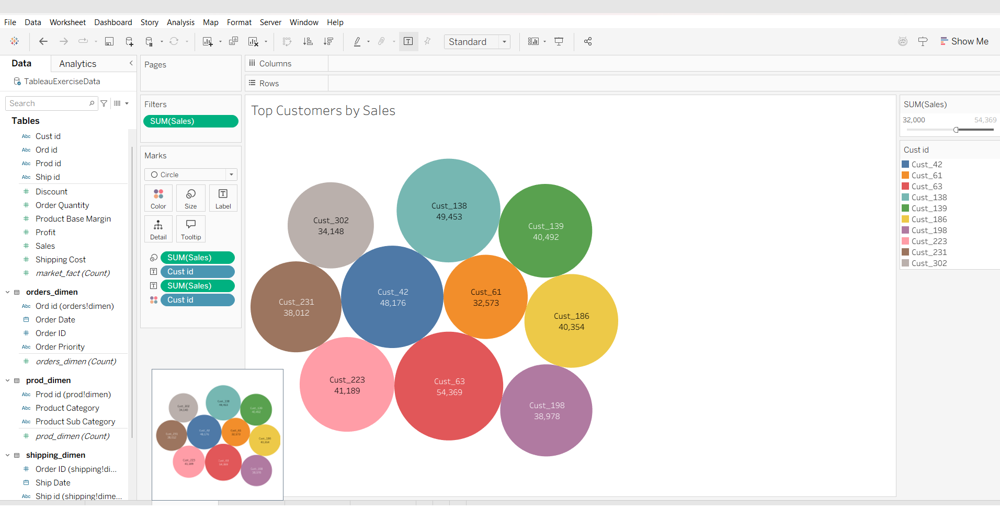
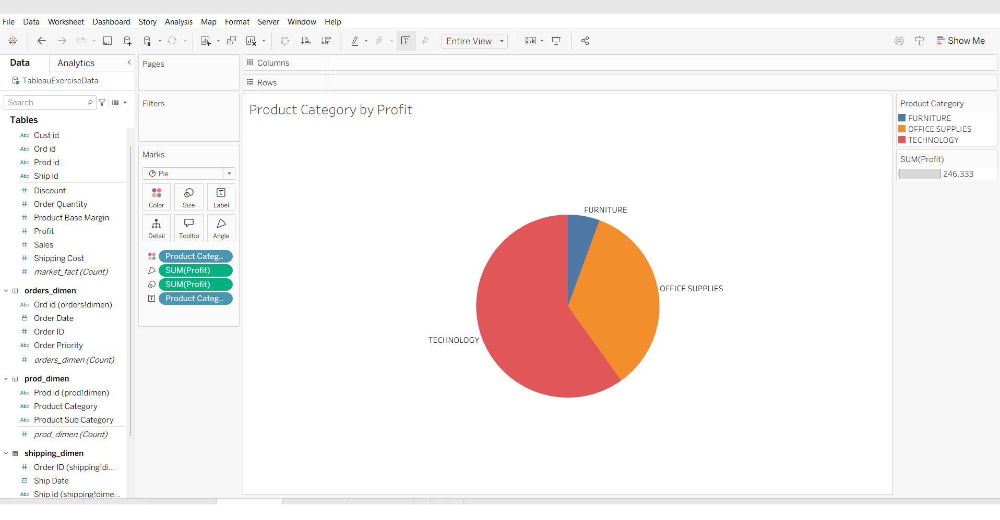
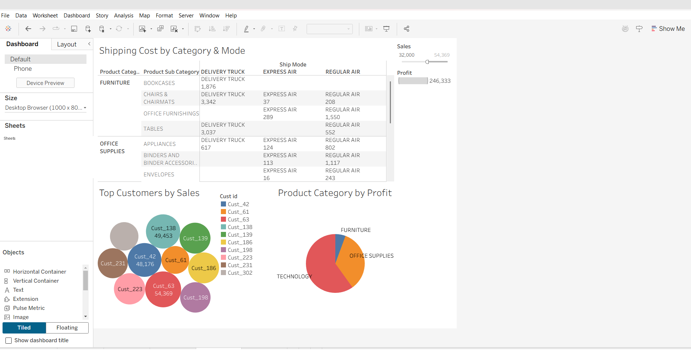
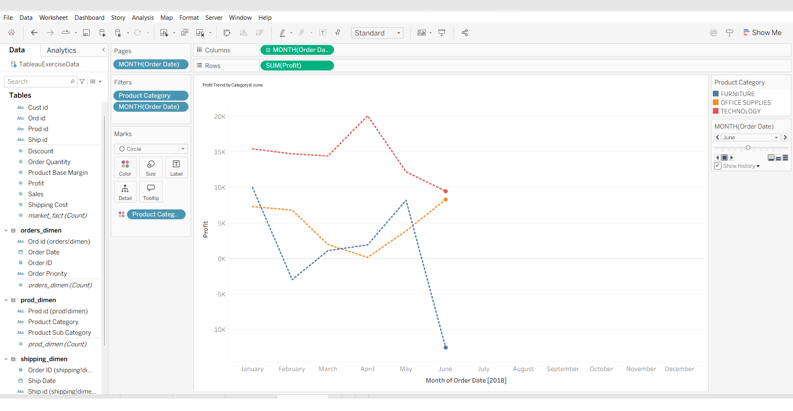
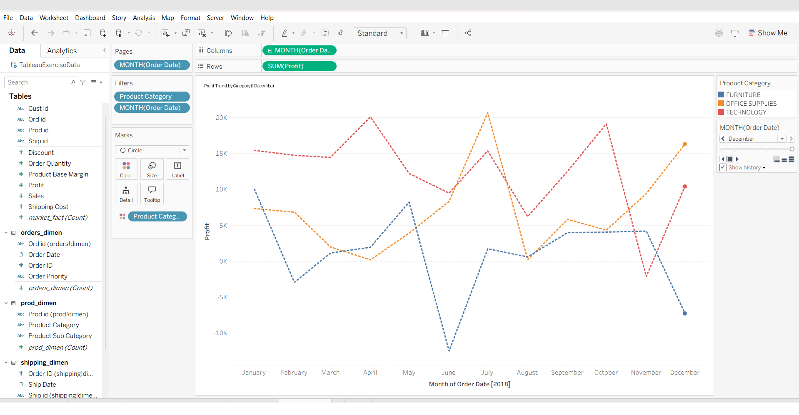

# Retail Business Intelligence Dashboard (Tableau)

An interactive Tableau dashboard built on a year of transactional retail data, covering shipping economics, top-customer analysis, category profitability, and a time-lapse profit trend.

**Goal:** Given a year of transactional retail data (orders, products, shipping, and a central fact table) spread across four related worksheets, build a connected data model in Tableau and design a set of visualizations that a business stakeholder could use to understand shipping costs, top customers, and category-level profitability.

**Data model:** the `market_fact` fact table was joined to `orders_dimen`, `prod_dimen`, and `shipping_dimen` (three joins total) to build a single analyzable data source.

## 2a. Shipping cost by category, sub-category & mode

A cross-tab breaks total shipping cost down by `Product Category` → `Product Sub-Category` (rows) and `Ship Mode` (columns), filtered to exclude records with a null shipping mode — useful for quickly spotting which product lines are disproportionately expensive to ship via a given carrier (e.g. Bookcases and Tables ship almost exclusively by delivery truck, while small office supplies lean heavily on regular air).



## 2b. Top customers by sales — packed bubble chart

A packed bubble chart highlights every customer with total sales ≥ $32,000, sized and labeled by both customer ID and total sales, making it easy to spot the highest-value accounts at a glance (top customer: **$54,369** in total sales).



## 2c. Profit share by product category — pie chart

A simple pie chart compares total profit contribution across the three product categories (Furniture, Office Supplies, Technology), with category labels placed directly on the slices.



## 2d. Executive dashboard

The three views above were combined into a single dashboard, giving a one-page view of shipping economics, top-customer value, and category profitability.



## 2e. Profit trend over time — motion chart

Using Tableau's Pages shelf with `MONTH(Order Date)` as a continuous field, a motion (time-lapse) chart animates cumulative profit by category across 2018. Two frames were captured mid-year and at year-end to show how the category trend lines evolve and diverge over time.




---

## 🛠️ Skills demonstrated

Multi-table data blending/joins, cross-tabs, packed bubble charts, pie charts, filters, dashboards, motion charts (Pages shelf), dashboard design

## 📁 Repository structure

```
├── README.md
└── screenshots/    # Tableau cross-tabs, charts, dashboard, motion chart
